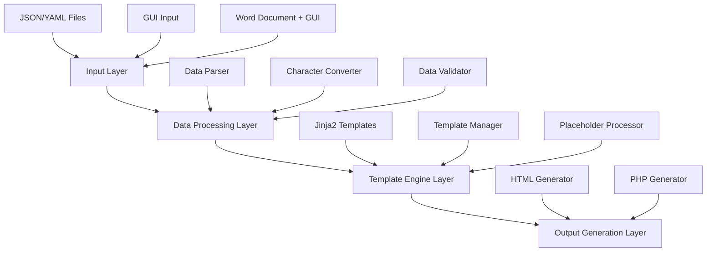

# Design Document

## Overview

Atobusu is designed as a modular Python application with three progressive versions, each building upon the previous one's functionality. The architecture emphasizes code reuse, maintainability, and clear separation of concerns. The core processing engine remains consistent across all versions, while the input mechanisms evolve from file-based to GUI-based to integrated document processing.

## Architecture

### High-Level Architecture



### Version-Specific Architecture

**Version 1**: File Input → Data Processing → Template Rendering → File Output
**Version 2**: GUI Input → JSON Conversion → Version 1 Pipeline
**Version 3**: GUI + Word Input → Combined Processing → YAML/JSON Generation → Version 1 Pipeline

## Components and Interfaces

### Core Components

#### 1. Data Processing Engine (`atobusu/core/`)

**DataProcessor Class**
```python
class DataProcessor:
    def parse_json(self, file_path: str) -> dict
    def parse_yaml(self, file_path: str) -> dict
    def validate_data(self, data: dict) -> bool
    def process_data(self, data: dict) -> dict
```

**CharacterConverter Class**
```python
class CharacterConverter:
    def convert_quotes(self, text: str) -> str
    def convert_circled_numbers(self, text: str) -> str
    def convert_symbols(self, text: str) -> str
    def apply_all_conversions(self, text: str) -> str
```

#### 2. Template Engine (`atobusu/templates/`)

**TemplateManager Class**
```python
class TemplateManager:
    def __init__(self, template_dir: str)
    def load_template(self, template_name: str) -> Template
    def render_html(self, template_name: str, data: dict) -> str
    def render_php(self, template_name: str, data: dict) -> str
    def render_mixed_template(self, template_name: str, data: dict) -> str
    def process_php_functions(self, content: str, data: dict) -> str
```

**PlaceholderProcessor Class**
```python
class PlaceholderProcessor:
    def process_product_codes(self, content: str, data: dict) -> str
    def process_date_placeholders(self, content: str, data: dict) -> str
    def process_php_function_params(self, content: str, data: dict) -> str
    def apply_all_replacements(self, content: str, data: dict) -> str
```

#### 3. GUI Components (`atobusu/gui/`)

**BaseGUI Class (Abstract)**
```python
class BaseGUI:
    def create_main_window(self) -> None
    def setup_input_fields(self) -> None
    def handle_submit(self) -> dict
    def show_error(self, message: str) -> None
    def show_success(self, message: str) -> None
```

**TkinterGUI Class**
```python
class TkinterGUI(BaseGUI):
    # Tkinter-specific implementation
```

**PyQt5GUI Class**
```python
class PyQt5GUI(BaseGUI):
    # PyQt5-specific implementation
```

#### 4. File Handlers (`atobusu/file_handlers/`)

**WordDocumentReader Class**
```python
class WordDocumentReader:
    def read_document(self, file_path: str) -> str
    def extract_text(self, document) -> str
    def extract_formatting(self, document) -> dict
```

**OutputWriter Class**
```python
class OutputWriter:
    def write_html(self, content: str, output_path: str) -> None
    def write_php(self, content: str, output_path: str) -> None
    def write_json(self, data: dict, output_path: str) -> None
    def write_yaml(self, data: dict, output_path: str) -> None
```

### Interface Definitions

#### Data Flow Interfaces

1. **Input Interface**: Standardized data structure for all input sources
2. **Processing Interface**: Consistent API for data transformation
3. **Template Interface**: Unified template rendering system
4. **Output Interface**: Standardized file generation methods

## Data Models

### Core Data Structures

#### InputData Model
```python
@dataclass
class InputData:
    content: str
    metadata: dict
    source_type: str  # 'json', 'yaml', 'gui', 'word'
    timestamp: datetime
    
    def to_dict(self) -> dict
    def from_dict(cls, data: dict) -> 'InputData'
```

#### ProcessedData Model
```python
@dataclass
class ProcessedData:
    converted_content: str
    template_variables: dict
    output_format: str  # 'html', 'php', 'mixed'
    template_type: str  # 'page', 'index', 'content'
    
    def to_template_context(self) -> dict
```

#### TemplateData Model
```python
@dataclass
class TemplateData:
    product_code: str
    product_name: str
    dates: dict  # {'post_date': '2025/01/15', 'short_date': '25/01/15'}
    category: str
    reviewer_name: str
    rating: int
    
    def to_placeholder_dict(self) -> dict
```

#### Configuration Model
```python
@dataclass
class AtobusuConfig:
    template_directory: str
    output_directory: str
    gui_framework: str  # 'tkinter', 'pyqt5'
    character_conversion_rules: dict
    
    @classmethod
    def load_from_file(cls, config_path: str) -> 'AtobusuConfig'
```

### Character Conversion Mapping
```python
CONVERSION_RULES = {
    'quotes': {'"': '"', '"': '"'},
    'symbols': {'※': '※'},  # Keep as-is
    'circled_numbers': {
        '①': '&#9312;', '②': '&#9313;', '③': '&#9314;',
        # ... additional mappings
    },
    'special_symbols': {
        '◎': '&#9678;',
        'ハート': '&#9825;',
        '♪': '&#9834;'
    }
}
```

### Template Placeholder Patterns
```python
PLACEHOLDER_PATTERNS = {
    'product_code': r'[^/]*コード[^/]*',  # Matches product code patterns
    'date_full': r'2025/00/00',  # Full date format
    'date_short': r"'25/00/00",  # Short date format
    'php_function': r'<\?=prod_info\("([^"]*)", "([^"]*)"\)\?>',  # PHP function calls
    'category_placeholder': r'カテゴリ[^}]*',  # Category placeholders
}
```

## Error Handling

### Error Categories

1. **Input Errors**: Invalid file formats, missing files, corrupted data
2. **Processing Errors**: Character conversion failures, template rendering errors
3. **Output Errors**: File write permissions, disk space issues
4. **GUI Errors**: Invalid user input, widget initialization failures

### Error Handling Strategy

#### Exception Hierarchy
```python
class AtobusuError(Exception):
    """Base exception for Atobusu application"""
    pass

class InputError(AtobusuError):
    """Errors related to input processing"""
    pass

class ProcessingError(AtobusuError):
    """Errors during data processing"""
    pass

class TemplateError(AtobusuError):
    """Errors in template rendering"""
    pass

class OutputError(AtobusuError):
    """Errors during output generation"""
    pass
```

#### Error Recovery Mechanisms

1. **Graceful Degradation**: Continue processing with default values when possible
2. **User Feedback**: Clear error messages with suggested solutions
3. **Logging**: Comprehensive logging for debugging and monitoring
4. **Retry Logic**: Automatic retry for transient failures

## Testing Strategy

### Unit Testing

- **Data Processing**: Test character conversion rules, file parsing, data validation
- **Template Rendering**: Test template loading, variable substitution, output generation
- **GUI Components**: Test input validation, event handling, error display
- **File Operations**: Test file reading, writing, and error conditions

### Integration Testing

- **End-to-End Workflows**: Test complete data flow from input to output for each version
- **Cross-Component**: Test interactions between data processing, templating, and GUI
- **File Format Compatibility**: Test with various JSON, YAML, and Word document formats

### Test Data Strategy

```python
# Sample test data structure
TEST_DATA = {
    'simple_text': 'Hello "world" with ① and ◎',
    'complex_content': {
        'title': 'Test Document',
        'body': 'Content with ♪ and ハート symbols',
        'metadata': {'author': 'Test User'}
    },
    'edge_cases': {
        'empty_content': '',
        'special_chars_only': '※①②③◎ハート♪',
        'mixed_quotes': '"Hello" and "world"'
    },
    'template_data': {
        'product_code': 'サンプル商品コード123456',
        'product_name': 'テスト商品名',
        'post_date': '2025/01/15',
        'short_date': '25/01/15',
        'category': 'テストカテゴリ',
        'reviewer_name': 'テスト評価者名前',
        'rating': 5
    },
    'php_template_content': '''
    <a href="/review-<?=prod_info("サンプル商品コード123456", "pname")?>">
    <?=prod_info("サンプル商品コード123456", "pname")?>
    </a>
    '''
}
```

### Performance Testing

- **Large File Processing**: Test with large JSON/YAML files and Word documents
- **Memory Usage**: Monitor memory consumption during processing
- **GUI Responsiveness**: Ensure UI remains responsive during long operations
- **Template Rendering Speed**: Benchmark template rendering performance

### Version-Specific Testing

**Version 1**: Focus on file I/O, data parsing, and template rendering
**Version 2**: Add GUI interaction testing, input validation, and user experience flows
**Version 3**: Include Word document processing, file selection dialogs, and integrated workflows